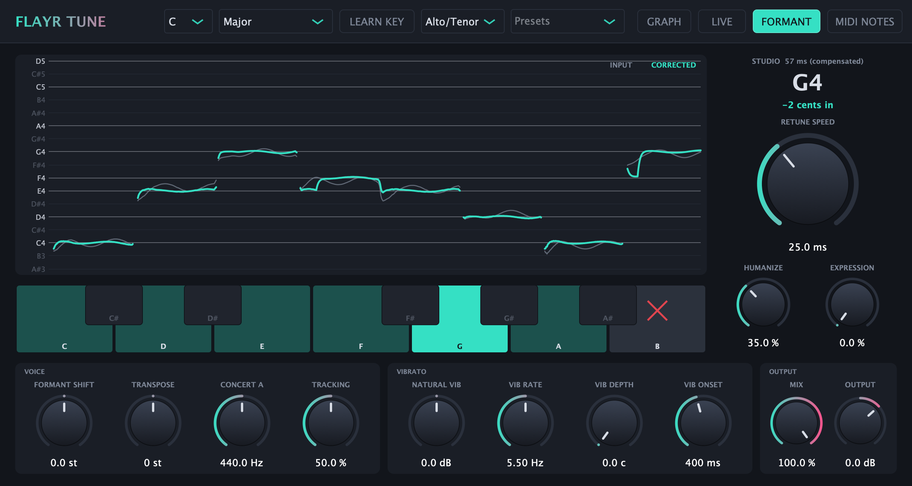
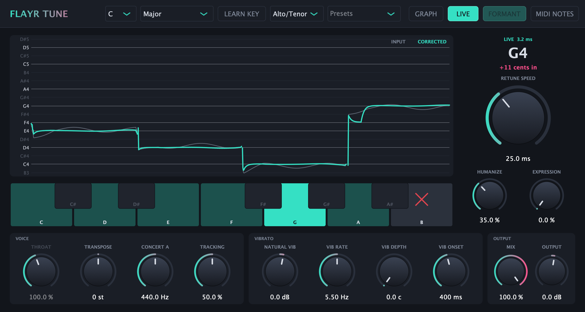
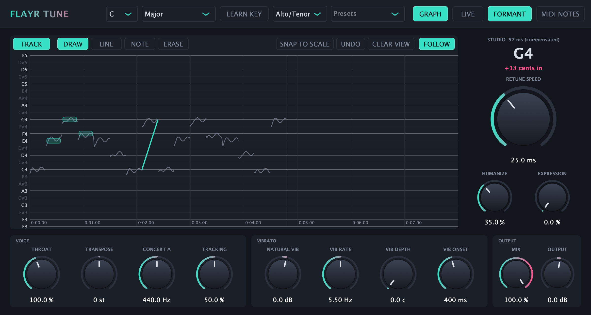

# Flayr Tune

Free, open-source real-time pitch correction for your DAW. Hard-tune effect or invisible
correction, a near-zero-latency Live mode for tracking and performing, and a Graph mode for
drawing pitch by hand.

**AU and VST3 on macOS, VST3 on Windows, VST3 and LV2 on Linux.**



## Install

Grab the latest version from **[Releases](https://github.com/FlayrLabs/flayr-tune/releases/latest)**.

| Your computer | Download | Formats |
|---|---|---|
| Mac (Apple silicon or Intel, macOS 11+) | `FlayrTune-<version>-macOS.dmg` | AU + VST3 |
| Windows 10/11 (64-bit) | `FlayrTune-<version>-Windows-Setup.exe` | VST3 |
| Linux (x64) | `FlayrTune-<version>-Linux-x64.tar.gz` | VST3 + LV2 |

### Mac
1. Open the DMG.
2. Drag **Flayr Tune.component** onto **Drag AU here** and **Flayr Tune.vst3** onto **Drag VST3 here**. macOS asks for your password because these are the shared plug-in folders.
3. Restart your DAW.

The Mac build is signed and notarized, so it opens without security warnings.

### Windows
Run the installer. It puts the plug-in in `C:\Program Files\Common Files\VST3`, where every VST3 host looks.
The installer isn't code-signed yet, so Windows may say "Windows protected your PC": click **More info**, then **Run anyway**.

### Linux
```sh
tar xzf FlayrTune-*-Linux-x64.tar.gz
cd FlayrTune-*-Linux-x64 && ./install.sh     # installs to ~/.vst3 and ~/.lv2
```

### Finding it in your DAW

| DAW | Where it shows up | If it's missing |
|---|---|---|
| Logic Pro / GarageBand | Audio FX > Audio Units > Flayr Labs > Flayr Tune | Settings > Plug-in Manager > Reset & Rescan Selection |
| Ableton Live | Plug-Ins > VST3 > Flayr Labs | Settings > Plug-Ins > turn on "Use VST3 Plug-In System Folders" > Rescan |
| FL Studio | Plugin database > Effects | Options > Manage plugins > Find more plugins |
| Cubase / Nuendo | Pitch Shift > Flayr Tune | Studio > VST Plug-in Manager > Update |
| Studio One | Effects > VST3 > Flayr Labs | Options > Locations > VST Plug-ins > Reset Blocklist, restart |
| Reaper | FX browser > VST3 | Preferences > Plug-ins > VST > Re-scan |
| Bitwig | Device browser > Flayr Labs | Settings > Locations > Rescan |

Pro Tools (AAX) isn't supported.

## Using it

Put Flayr Tune on a vocal track, set the **Key** and **Scale** (or press **LEARN KEY**, play the
part, and press it again), then turn **Retune Speed**:

- **0 ms**: the classic hard-tune effect.
- **20 to 50 ms**: polished pop vocal.
- **100 ms and up**: subtle, natural correction.

| Control | What it does |
|---|---|
| Humanize | Short notes snap fast; long held notes ease in, so they keep their natural drift. |
| Expression | Only corrects notes already close to pitch. Scoops, slides and bends are left alone. |
| Natural Vib | Makes the singer's own vibrato deeper or shallower (±12 dB). |
| Formant / Formant Shift | Formant keeps the voice's character when shifting. Formant Shift (±6 st) makes the voice deeper or brighter on purpose. |
| Transpose | ±12 semitones. |
| Vib Rate / Depth / Onset | Adds vibrato to held notes. |
| Keyboard | Click a note to stop correcting to it (red X). |
| MIDI NOTES | Play the melody on a MIDI track (side-chain MIDI in Logic) and the voice follows it. |
| Input Type, Tracking, Concert A | Voice range, detection sensitivity, reference tuning. |

### Studio and Live

- **Studio** (default) has the best quality on big shifts. It has 57 ms of latency, which your DAW
  compensates on playback.
- **LIVE** is for recording and performing through the plug-in. Latency is about 1.5 ms on high
  notes up to about 10 ms on a low male voice, and the current value is shown above the note
  readout. Formant and Formant Shift work in both modes.



### Graph mode

For exact, note-by-note control:

1. Press **GRAPH**, then **TRACK**, and play the song. The vocal's pitch is captured along the timeline.
2. Edit:
   - **DRAW**: the output follows exactly what you draw.
   - **LINE**: straight slides between two points.
   - **NOTE**: drag a note onto a semitone. The singer's vibrato is kept.
   - **ERASE**: removes edits; erased spots go back to automatic correction.
   - **SNAP TO SCALE**: turns everything in view into notes on the scale.
   - **UNDO**: also Cmd+Z, if your DAW passes keys to plug-ins.
3. Play it back. Anything you didn't edit is still corrected automatically.

Scroll to move up and down, shift-scroll or swipe sideways to move along the song, and
Cmd/Ctrl-scroll or pinch to zoom. Edits are saved with your project.



## Build from source

You need CMake 3.22+ and a C++17 compiler (Xcode on macOS, Visual Studio 2022 on Windows,
GCC or Clang on Linux). JUCE is downloaded automatically.

```sh
cmake -S . -B build -DCMAKE_BUILD_TYPE=Release
cmake --build build --config Release --parallel
ctest --test-dir build -C Release --output-on-failure
```

The plug-ins are copied into your user plug-in folders after building
(`-DFLAYR_TUNE_COPY_AFTER_BUILD=OFF` to skip). On Linux, first install
`libasound2-dev libfreetype6-dev libfontconfig1-dev libx11-dev libxcomposite-dev libxcursor-dev libxext-dev libxinerama-dev libxrandr-dev libxrender-dev libgl1-mesa-dev`.

`-DFLAYR_TUNE_BUILD_TOOLS=ON` adds two developer tools:
- **`FlayrTuneSnapshot out.png [live|graph]`** renders the UI without a DAW.
- **`render in.wav prefix`** runs a mono 32-bit float WAV through every mode and reports how in-tune each result is.

## How it works

All the DSP is in [`Source/TuneEngine.h`](Source/TuneEngine.h), with no framework dependencies,
so it can be tested on its own ([`tests/engine_test.cpp`](tests/engine_test.cpp)):

- **Pitch detection:** YIN, computed with FFT cross-correlation.
- **Correction:** the target note is chosen on a vibrato-free pitch centre, with hysteresis and fast
  re-targeting on real note changes. On top of that sit Retune Speed smoothing, Humanize,
  Expression, Natural Vibrato rescaling, synthetic vibrato and Graph-mode edits.
- **Studio mode:** TD-PSOLA. Grains always span one input period, which keeps the formants in
  place; resampling the grains moves them (Formant Shift).
- **Live mode:**
  - A pitch-synchronous delay-line shifter that splices whole periods, with no look-ahead.
  - It predicts the current pitch across the analysis gap, and sizes its analysis window from
    the voice it is tracking.
  - Formants come from an LPC split: the flat residual is shifted, then the spectral envelope is
    re-applied (Formant Shift stretches it first).

## Contributing

Bug reports, DAW compatibility notes and pull requests are welcome. See [CONTRIBUTING.md](CONTRIBUTING.md).

## Security

Flayr Tune makes no network connections and collects no data. Every release includes
`SHA256SUMS.txt`, the Mac build is signed and notarized, and the Windows and Linux builds carry
GitHub build provenance. See [SECURITY.md](SECURITY.md) to verify a download or report a
vulnerability privately.

## License

Flayr Tune is licensed under the [GNU AGPLv3](LICENSE), because it is built on
[JUCE](https://juce.com), which is free for open-source projects under the AGPLv3. The VST3
SDK is MIT-licensed and LV2 is ISC-licensed; see [THIRD_PARTY_NOTICES.md](THIRD_PARTY_NOTICES.md).

Auto-Tune and Flex-Tune are trademarks of Antares Audio Technologies. Flayr Tune is an
independent project and is not affiliated with or endorsed by Antares.
